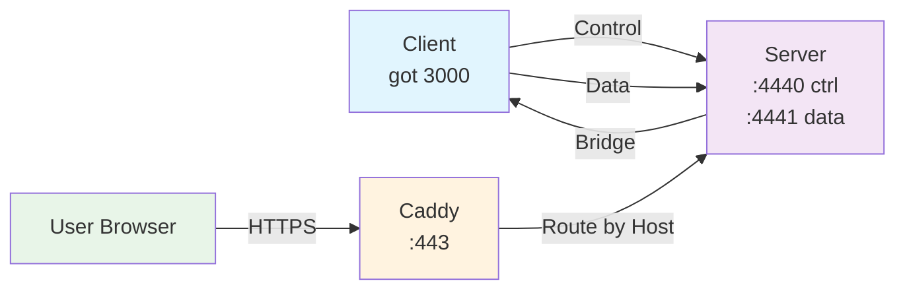
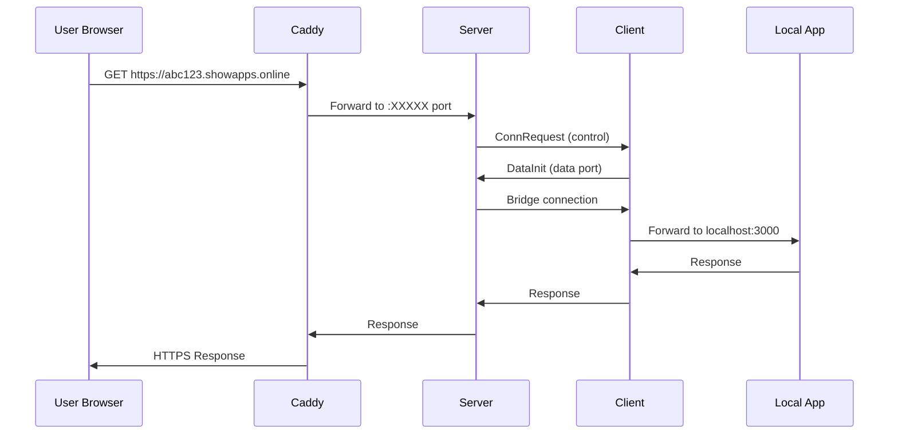
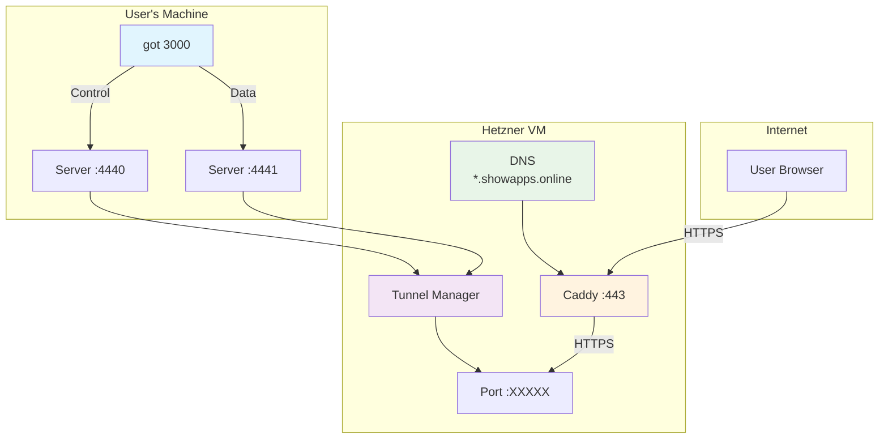

# GOT (Simple http tunnel in GO)

A Go-based reverse tunnel system similar to ngrok, allowing you to expose local services to the internet with custom subdomains.

## Features

- 🚀 **Simple CLI**: `got 3000` to expose local port 3000
- 🌐 **Custom Subdomains**: Get random subdomains like `abc123.showapps.online`
- 🔒 **SSL/TLS**: Automatic HTTPS with Let's Encrypt certificates
- ⚡ **Fast**: Built with Go for high performance
- 🛠️ **Self-hosted**: Use your own infrastructure

## Quick Start

### For Users

1. **Install the client** (choose one):

   **Option A: One-line install (recommended)**
   ```bash
   curl -sSL https://raw.githubusercontent.com/HeyRistaa/got/main/install.sh | bash
   ```

   **Option B: Go install (requires Go)**
   ```bash
   go install github.com/HeyRistaa/got/cmd/client@latest
   ```

   **Option C: Download binary manually**
   - Go to [releases](https://github.com/HeyRistaa/got/releases)
   - Download the binary for your platform
   - Make it executable: `chmod +x got-*`
   - Move to PATH: `sudo mv got-* /usr/local/bin/got`

2. **Expose a local service**:
   ```bash
   got 3000
   # Output: tunnel established: localhost:3000 -> 168.119.161.113:45123 (https://abc123.showapps.online)
   ```

3. **Share your URL**: `https://abc123.showapps.online`

### For Server Administrators

1. **Deploy the server**:
   ```bash
   go build -o server ./cmd/server
   ./server -public YOUR_SERVER_IP
   ```

2. **Configure Caddy**:
   ```caddyfile
   {
     admin localhost:2019
   }

   # Wildcard for tunnels
   *.showapps.online {
       reverse_proxy 127.0.0.1:4440
   }
   ```

3. **Set up DNS**:
   - A Record: `showapps.online` → `YOUR_SERVER_IP`
   - CNAME Record: `*.showapps.online` → `showapps.online`

## Architecture



## Protocol

The system uses a custom JSON-over-TCP protocol:

- **Control Connection** (port 4440): Tunnel management
- **Data Connection** (port 4441): Data forwarding
- **Public Ports** (dynamic): Individual tunnel endpoints

### Tunnel Flow



## Configuration

### Client Environment Variables

- `GOT_SERVER_HOST`: Server hostname (default: auto-detect from Hetzner)
- `GOT_CONTROL_PORT`: Control port (default: 4440)
- `GOT_DATA_PORT`: Data port (default: 4441)

### Server Environment Variables

- `PUBLIC_PORT`: Force specific public port (optional)

## Development

### Building

```bash
# Build client
go build -o got ./cmd/got

# Build server
go build -o server ./cmd/server

# Cross-compile for Linux
GOOS=linux GOARCH=amd64 go build -o server-linux ./cmd/server
```

### Project Structure

```
├── cmd/
│   ├── got/           # Client CLI
│   └── server/        # Server CLI
├── internal/
│   ├── client/        # Client implementation
│   ├── server/        # Server implementation
│   └── control/       # Protocol definitions
└── README.md
```

### Deployment Architecture



## License

MIT License - see LICENSE file for details.

## Contributing

1. Fork the repository
2. Create a feature branch
3. Make your changes
4. Submit a pull request

## Support

For issues and questions, please open an issue on GitHub.
